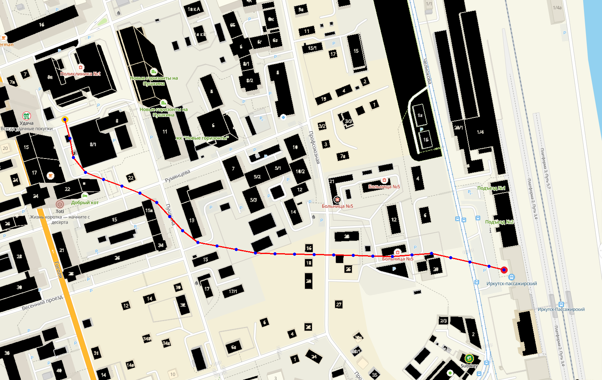

## Алгоритм LIAN

### Начало работы
1. **Склонируйте проект:**
```bash
git clone https://github.com/groknut/lian.git
cd lian
```

2. **Соберите зависимости:**
```bash
uv sync
```

3. **Скомпилируйте проект:**
```bash
compile.bat
```

4. **Попробуйте изменить конфигурацию и перезапустить проект:**
```bash
run.bat
```

### Конфигурация проекта
```ini
; lian алгоритм
[lian]
// стартовая и конечная точки
start: (165, 305)
goal: (1287, 689)
// файл с картой
map: ./input/map.txt

// угол и расстояние
angle: 30
theta: 50
// куда сохраняем координаты карты
[output]
file: ./output/coords.txt
```

### Запуск работы

```bash
run project...
16:03:30,81
Image shape: (971, 1538, 3)
16:03:33,49
Map file: ./input/map.txt
Map loaded successfully: 1538 x 971
Start: (305, 165)
Goal: (689, 1287)
Theta: 50, Max angle: 30 deg
Goal reached after 114453 iterations!
Path found with 27 points:
(165, 305)
(178, 353)
(187, 402)
(218, 440)
(264, 458)
(311, 475)
(357, 493)
(400, 517)
(433, 553)
(466, 589)
(505, 619)
(554, 628)
(603, 637)
(652, 646)
(702, 648)
(752, 649)
(802, 650)
(852, 651)
(902, 652)
(952, 654)
(1002, 655)
(1052, 651)
(1102, 647)
(1151, 658)
(1200, 669)
(1249, 680)
(1287, 689)
16:06:12,52
```


