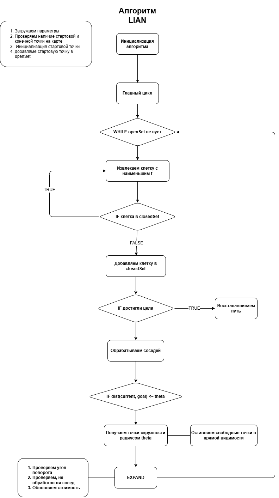

## Алгоритм LIAN

### Описание алгоритма
Алгоритм находит путь с ограничением на максимальный угол поворота между последовательными сегментами пути.




### Начало работы
1. **Склонируйте проект:**
```bash
git clone https://github.com/groknut/lian.git
cd lian
```

2. **Соберите зависимости:**
```bash
uv sync
```

3. **Запустите проект:**
```bash
uv run app.py
```

### Конфигурация проекта
```ini
; название компилируемого/запускаемого приложения
[app]
name: main

; входные файлы
[input]
image:./input/karta-01.bmp
map:./input/map.txt

; параметры алгоритма
[lian]
map:./input/map.txt
angle:40
theta:80
; start и goal точки задаются в GUI

; что получаем на выходе
[output]
; координаты точек в формате x y
points:./output/points.txt
; название файл с анимацией будет ./output/path.gif
output_file:./output/path.png
; если указываем, то сохраняем в angles углы поворота между точками
angles:./output/angles.txt

; параметры анимации
[animation]
enabled:true
save_to_file:true
```

### Результат работы алгоритма

<div align="center">

</div>
