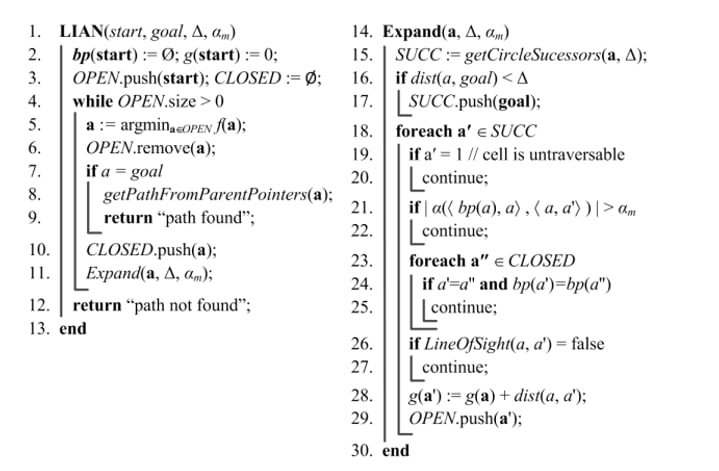
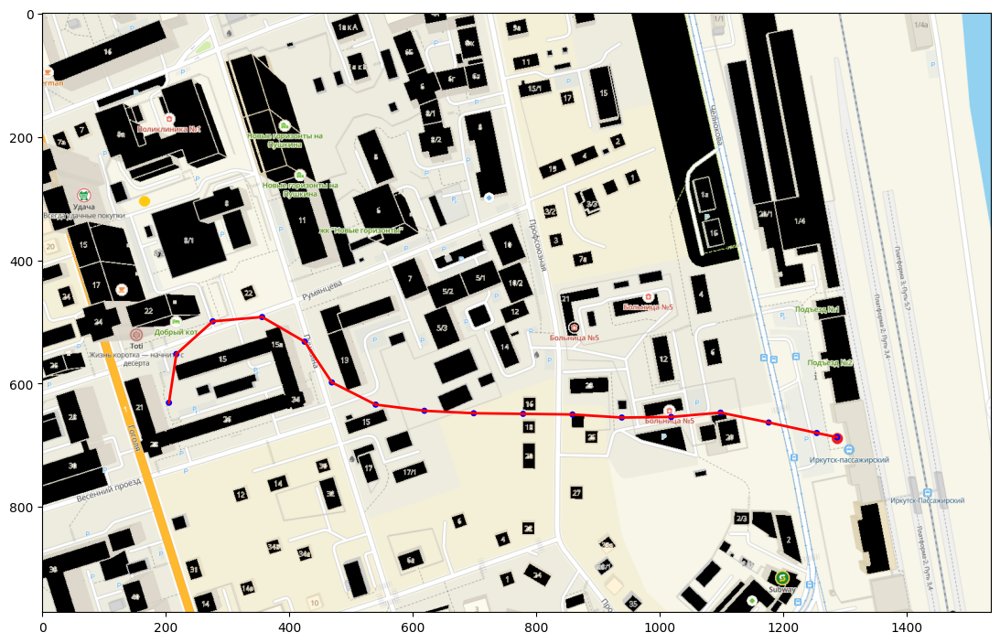
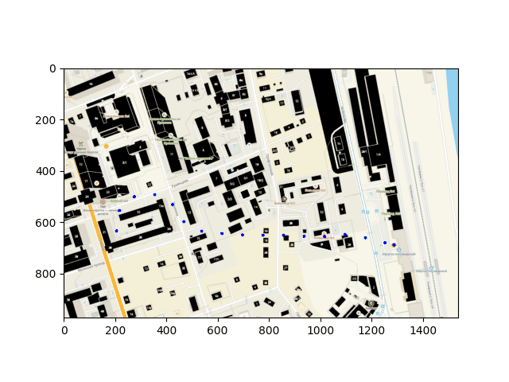

## Алгоритм LIAN

### Описание алгоритма


### Начало работы
1. **Склонируйте проект:**
```bash
git clone https://github.com/groknut/lian.git
cd lian
```

2. **Соберите зависимости:**
```bash
uv sync
```

3. **Запустите проект:**
```bash
uv run app.py
```

### Конфигурация проекта
```ini
; вводные данные
[input]
image:./input/karta-01.bmp
map:./input/map.txt
; алгоритм
[lian]
start:(208, 620)
goal:(1287, 688)
map:./input/map.txt
angle:30
theta:50
; выходные файлы
[output]
coords:./output/coords.txt
path_image:./output/path.png
```

### Результат работы алгоритма

<!--  -->
<div align="center">

</div>
