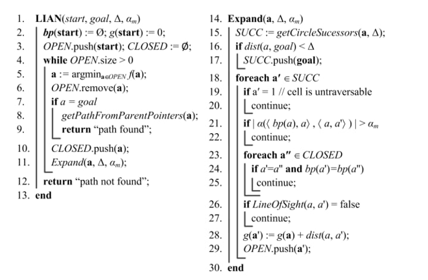
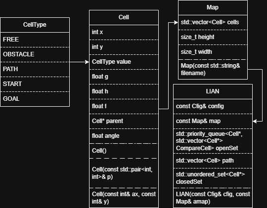
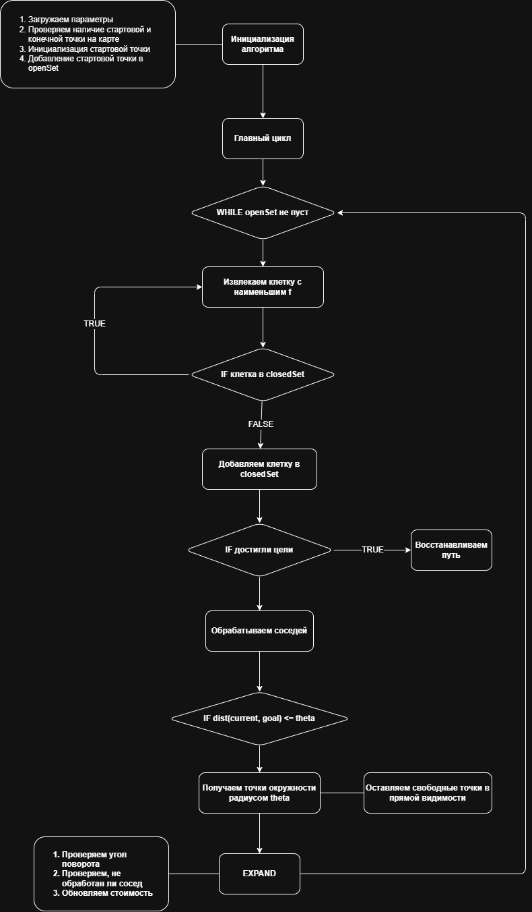
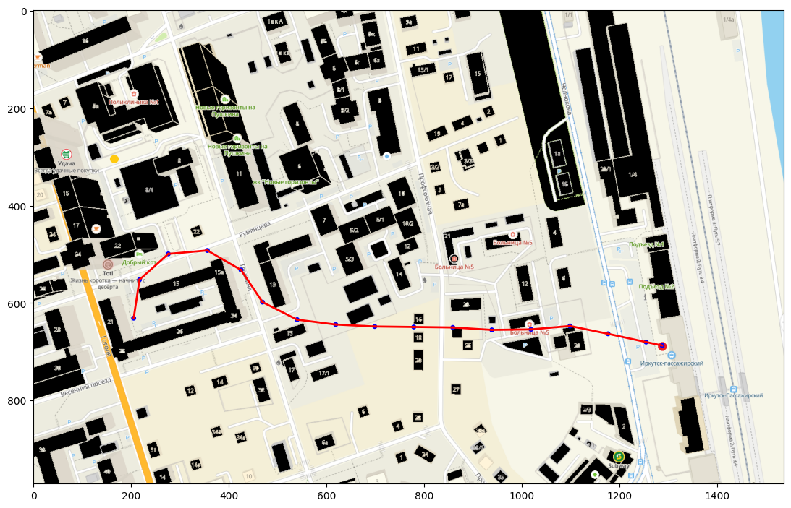
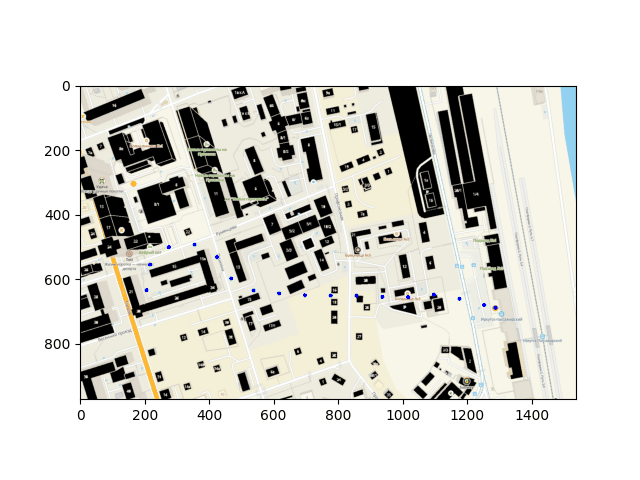

## Алгоритм LIAN

### Описание алгоритма
Алгоритм находит путь с ограничением на максимальный угол поворота между последовательными сегментами пути.






### Начало работы
1. **Склонируйте проект:**
```bash
git clone https://github.com/groknut/lian.git
cd lian
```

2. **Соберите зависимости:**
```bash
uv sync
```

3. **Запустите проект:**
```bash
uv run app.py
```

### Конфигурация проекта
```ini
[app]
name = main

[input]
image = ./input/karta-01.bmp
map = ./input/map.txt

[lian]
angle = 40
theta = 50
start = (677, 775)
goal = (724, 670)

[output]
points = ./output/points.txt
output_file = ./output/path.png
angles = ./output/angles.txt

[animation]
enabled = true
save_to_file = true
```

### Результат работы алгоритма

<div align="center">

</div>
